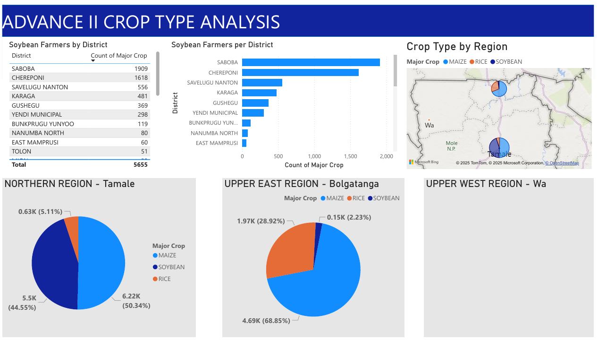
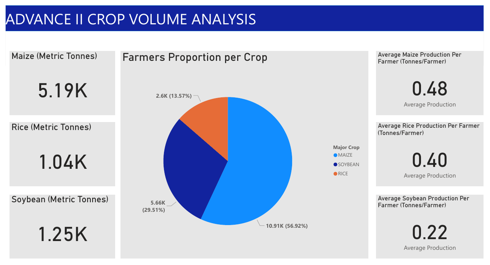

# AdvanceIIProject
Analysing Ghana Agricultural Data 

## Project Summary
The Ghana Agricultural Development and Value Chain Enhancement (ADVANCE) II project supports the
scaling up of agricultural investments to improve the competitiveness of the maize, rice, and soybean
value chains. This helps achieve a greater degree of food security among the rural population in the north
while increasing competitiveness in the domestic markets. The project adopts a value chain approach
where smallholder farmers are linked to markets, finance, inputs, equipment, and information through
larger commercial farmers and traders who have the capacity to invest in these chains. It also builds the
capacity of smallholder farmers to increase the efficiency of their farm business with improved production
and post-harvest handling practices, including: improved seed varieties; access to quality inputs;
mechanization services; and market access.

## Method
Python in VScdoe along with the Data Wrangler plugin was used to clean and transform the data into a usuable format, this was later transfer to PowerBI and the required charts generated based on the requirements if the project.
